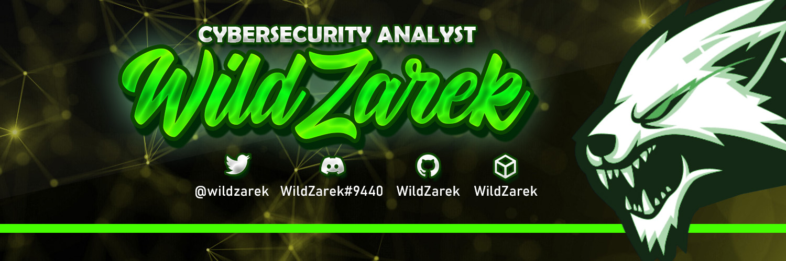

<!-- HEADER SECTION -->

  
  <h1 class="custom-font">Hi </h1>
  
  <h3 align="center">42 Málaga Student | Cybersecurity Analyst | Jr. Pentester | CTF Player | <em>Red Team</em> 🔴</h3>
  

      
  

<!-- ABOUT SECTION -->

## :wolf: About Me

- :books: As a student at 42 Málaga, I'm passionate about **Cybersecurity** and **Programming**.

- :seedling: I'm currently interested in **Ethical Hacking** and **Pentesting** (as a Red Team member)

- :computer: I am practicing in **[HackTheBox](https://www.hackthebox.com/)** sometimes. Solving challenges, CTF's and machines.

- :link: My website is available at **[wildzarek.github.io](https://wildzarek.github.io/)** (Write-Up posts)

- :video_game: Fun fact: **Sometimes I play videogames and I did it on streaming as hobby. I'm not streaming from some time ago.**

## :interrobang: Campus 42

Campus 42 is an innovative programming school that offers an educational approach without traditional teachers or classes.

With a project-based learning method and peer-to-peer collaboration,
students develop technical and problem-solving skills in a dynamic and challenging environment.

<!-- HACKTHEBOX SECTION -->

## HackTheBox Rank

  

<!-- SKILLS SECTION -->

## :gear: Skills

  <table>
    <tr>
      <th></th>
      <th>Experience with</th>
    </tr>
    <tr>
      <td>🖥️ Operating Systems</td>
      <td>
        
        
        
        
        
        
        
      </td>
    </tr>
    <tr>
      <td>📦 Virtualization</td>
      <td>
        
        
      </td>
    </tr>
    <tr>
      <td>🧑‍💻 Programming Languages</td>
      <td>
        
        
        
        
      </td>
    </tr>
    <tr>
      <td>🛠️ Frameworks</td>
      <td>
        
        
        
      </td>
    </tr>
    <tr>
      <td>📦 Package Management</td>
      <td>
        
        
      </td>
    </tr>
    <tr>
      <td>🔧 Tools and Platforms</td>
      <td>
        
        
        
      </td>
    </tr>
    <tr>
      <td>📖 Documentation</td>
      <td>
        
        
        
      </td>
    </tr>
    <tr>
      <td>🗂️ Databases</td>
      <td>
        
        
        
      </td>
    </tr>
    <tr>
      <td>🌐 Web Development</td>
      <td>
        
        
        
        
      </td>
    </tr>
    <tr>
      <td>💻 IDE / Code Editors</td>
      <td>
        
        
        
        
      </td>
    </tr>
  </table>

<!-- CVE SECTION -->

## :page_with_curl: CVE's

A list of my discovered CVE's:

<table>
  <tr>
    <th>CVE Number</th>
    <th>Description</th>
    <th>Product</th>
    <th>Versions</th>
  </tr>
  <tr>
    <td><a href="https://cve.mitre.org/cgi-bin/cvename.cgi?name=CVE-2022-23242" title="CVE-2022-23242" target="_blank">CVE-2022-23242</a></td>
    <td>Incomplete protection of local device settings.</td>
    <td>TeamViewer for Linux</td>
    <td>15.27 and lower</td>
  </tr>
</table>

<!-- STATS SECTION -->

## :bar_chart: My Github Stats

<!-- 

  
  

 -->

    

 

  
  

 
 

  

 

<!-- TROPHIES SECTION -->

## Trophies

The following badges summarize my activity on this platform.

<a href="https://github.com/WildZarek">
  
   
  
</a>

<!-- CONTACT SECTION -->

## Contact Me

<!--  -->

<!-- VISITORS SECTION -->

## Visitors
